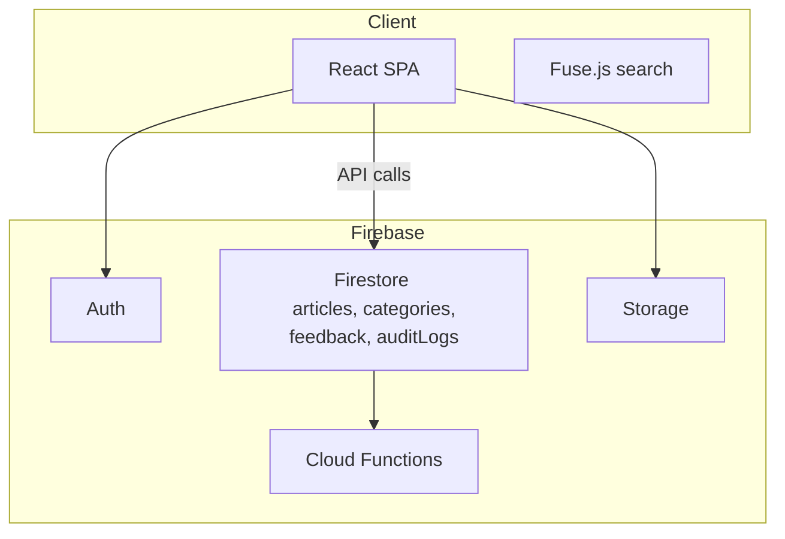

# IT Knowledge Base CMS (Self‑Service Portal)

> **A React + Firebase headless knowledge‑base that helps IT teams ship searchable, self‑service help content in minutes.**

---

\## 📚 Table of Contents

1. [Why build this?](#why-build-this)
2. [Features](#-features)
3. [Tech Stack](#-tech-stack)
4. [Architecture Diagram](#-architecture-diagram)
5. [Getting Started](#-getting-started)
6. [Configuration](#-configuration)
7. [Project Structure](#-project-structure)
8. [Deployment Guides](#-deployment-guides)
9. [Extending the CMS](#-extending-the-cms)
10. [Contribution Guide](#-contribution-guide)
11. [Roadmap](#-roadmap)
12. [License](#-license)

---

\## Why build this?
Internal IT teams are often swamped by repeat "How do I…?" tickets. A good self‑service portal lets end‑users help themselves and keeps your engineers sane. Commercial KB platforms can be pricey or heavy—so here’s a lightweight, open‑source alternative you can host anywhere.

---

\## ✨ Features

\### Content Management

|  Feature                |  Details                                                                                      |
| ----------------------- | --------------------------------------------------------------------------------------------- |
| **Rich‑Text Editor**    | TipTap‑powered WYSIWYG with Markdown shortcuts, code blocks, tables & drag‑drop image upload. |
| **Categories & Tags**   | Nestable categories + free‑form tags for precise organisation.                                |
| **Drafts & Scheduling** | Save drafts, schedule future publish dates, or revert with one‑click version history.         |
| **Attachments**         | Upload PDFs, zip files, screenshots—stored in Firebase Storage and served via signed URLs.    |

\### Search & Navigation

|  Feature                       |  Details                                                            |
| ------------------------------ | ------------------------------------------------------------------- |
| **Instant Client‑Side Search** | Fuse.js fuzzy matching across titles, body text, categories & tags. |
| **Breadcrumbs**                | Auto‑generated breadcrumbs for quick back‑tracking.                 |
| **Smart Filters**              | Filter results by category, tag, or author in a single click.       |

\### Collaboration & Feedback

|  Feature              |  Details                                                                           |
| --------------------- | ---------------------------------------------------------------------------------- |
| **Role‑Based Access** | Three roles: *Viewer*, *Editor*, *Admin*. Granular Firestore rules keep data safe. |
| **Reaction Widget**   | 👍 / 👎 with optional free‑text comments—surface articles that need work.          |
| **Revision Comments** | Inline editor comments to discuss changes before publishing.                       |

\### Analytics & Quality

|  Feature                |  Details                                                                              |
| ----------------------- | ------------------------------------------------------------------------------------- |
| **Per‑Article Metrics** | Views, click‑throughs, helpfulness rating—all stored in BigQuery via Cloud Functions. |
| **Search Insights**     | See what users searched for but *didn’t* find, so you know what to write next.        |

\### Security & Compliance

* **Firebase Auth** with email + password or SSO (Google / Microsoft)
* **GDPR‑ready**: data residency selection & export on request
* **Audit Log**: every create/update/delete is stored in a separate `auditLogs` collection.

\### Developer Experience

* **Vite** for instant HMR
* **ESLint + Prettier** for consistent code
* **Vitest** unit tests & React Testing Library
* **Typed** Firestore collections using **zod** schemas.

---

\## 🛠️ Tech Stack

|  Layer               |  Technology                                                   |
| -------------------- | ------------------------------------------------------------- |
| **Frontend**         | React 18, Vite, Tailwind CSS, lucide‑react icons              |
| **Auth & DB**        | Firebase Auth, Cloud Firestore, Cloud Storage                 |
| **Functions**        | Cloud Functions for SSR search index & analytics stream       |
| **CI/CD**            | GitHub Actions → Firebase Hosting deploy preview & production |
| **Container (opt.)** | Dockerfile provided for on‑prem hosting                       |

---

\## 🗺 Architecture Diagram



---

\## 🚀 Getting Started

```bash
# 1. Clone repo
$ git clone https://github.com/<your‑handle>/it‑knowledge‑base.git
$ cd it‑knowledge‑base

# 2. Install deps
$ npm install   # or pnpm / yarn

# 3. Configure Firebase
$ cp .env.example .env
# → fill in keys (see below)

# 4. Run dev server
$ npm run dev     # http://localhost:5173
```

---

\## 🔒 Configuration

```
VITE_FIREBASE_API_KEY=xxx
VITE_FIREBASE_AUTH_DOMAIN=xxx.firebaseapp.com
VITE_FIREBASE_PROJECT_ID=xxx
VITE_FIREBASE_STORAGE_BUCKET=xxx.appspot.com
VITE_FIREBASE_MESSAGING_SENDER_ID=123456789
VITE_FIREBASE_APP_ID=1:123456789:web:abcdef
```

> **Tip:** Create multiple `.env.*` files (e.g. `.env.staging`, `.env.prod`) and start Vite with `--mode`.
> Secrets should *never* be committed—use GitHub Secrets for CI deploys.

---

\## 📂 Project Structure

```
├── public/            # static assets (logo, manifest, robots.txt)
├── src/
│   ├── components/
│   │   ├── Admin/
│   │   │   ├── ArticleEditor.jsx
│   │   │   └── FeedbackDashboard.jsx
│   │   ├── Auth/
│   │   │   ├── LoginForm.jsx
│   │   │   └── SignupForm.jsx
│   │   └── Reader/
│   │       ├── ArticleCard.jsx
│   │       └── SearchBar.jsx
│   ├── hooks/         # custom React hooks
│   ├── lib/           # firebase.js, fuseSearch.js, helpers
│   ├── pages/         # routed views (Home, Article, Admin…)
│   ├── App.jsx
│   └── main.jsx
├── functions/         # optional Cloud Functions (TypeScript)
├── scripts/           # one‑off maintenance scripts
└── Dockerfile
```

---

\## 🐳 Deployment Guides

| Target                         | Docs                                                                                                              |
| ------------------------------ | ----------------------------------------------------------------------------------------------------------------- |
| **Firebase Hosting** (default) | `npm run deploy` (requires `firebase-tools` & CLI login)                                                          |
| **Docker Compose**             | `docker compose up --build` – runs the SPA with Nginx and an emulated Firestore using the Firebase Emulator Suite |
| **Vercel**                     | Import repo → add env vars → set build command `npm run build` & output `/dist`                                   |

> **Scaling tip:** For heavy search traffic, swap Fuse.js with Algolia and preload indexes at build time.

---

\## 🔌 Extending the CMS

1. **Add File Attachments**: integrate FilePond in `ArticleEditor.jsx` and push to Storage.
2. **SSO Providers**: enable Google / Microsoft in Firebase Auth & update `AuthProvider.jsx`.
3. **Custom Theming**: override Tailwind config or inject CSS vars for company colours.

---

\## 🤝 Contribution Guide
Pull requests welcome! Please:

1. Fork & create a topic branch (`feat/my-awesome-feature`).
2. Write unit tests where reasonable.
3. Run `npm run lint:fix` & `npm test`.
4. Open the PR—fill in the template & link any related issues.

---

\## 📅 Roadmap

* [ ] **Full‑text search w/ Algolia**
* [ ] **Article approvals workflow**
* [ ] **i18n (react‑i18next)**
* [ ] **Dark mode scheduling**
* [ ] **Mobile offline mode (PWA)**

---

\## 📜 License
[MIT](LICENSE) — free for personal and commercial use. Credit is appreciated but not required.
